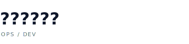
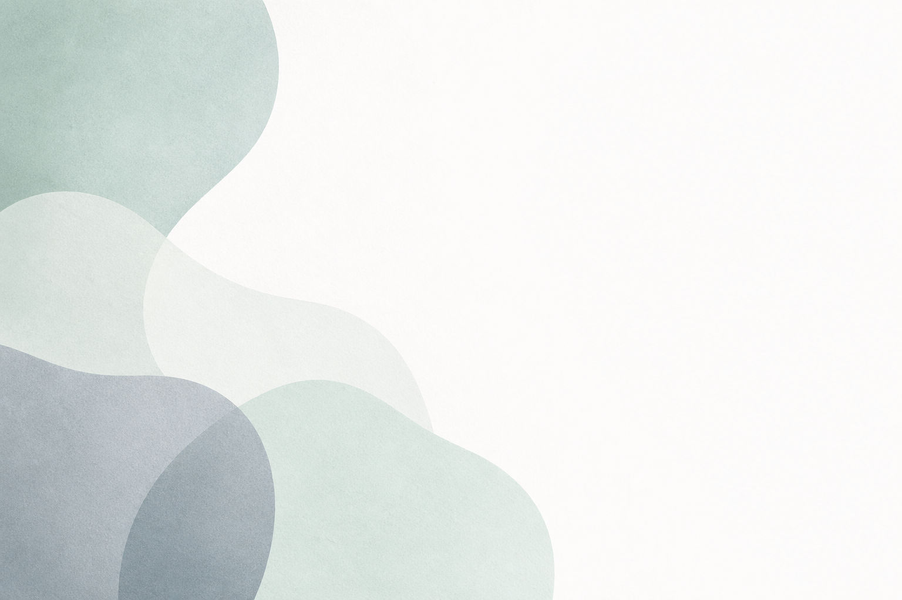

<picture>
  <source media="(prefers-color-scheme: dark)" srcset="./assets/wordmark-dark.svg" />
  
</picture>

### 시원한친구들의 개발자(Ops / Dev) 레포지토리입니다

---

## 우리는 CFDM으로 만들어요

**CFDM(CoolFriends Design Method)** 은 시원한친구들이 직접 정의한 디자인 방법론이에요.  
색·간격·타이포그래피·모션을 토큰 단위로 관리하고,  
React 컴포넌트와 Vite 데모로 바로 쓸 수 있게 만들었어요.

> 차분하고, 직관적이며, 한국어를 먼저 생각해요.

---

## 핵심 저장소

| 저장소 | 설명 |
|---|---|
| [**CFDM**](https://github.com/coolfriends-biz/CFDM) | CoolFriends Design Method — 디자인 토큰, React UI 컴포넌트, Vite 쇼케이스 |

---

## CFDM 4원칙

| 원칙 | 내용 |
|---|---|
| **Calm** | 채도 낮은 중성색 + 민트 액센트 하나. 그라데이션·네온 없이도 충분해요. |
| **Friendly** | UI 카피는 친구에게 말하듯 ~해요 톤. 딱딱하지 않게요. |
| **Direct** | 한 화면엔 핵심 액션 하나. 복잡한 선택지는 줄여요. |
| **Mindful** | 의미 없는 애니메이션은 없애요. 움직임엔 반드시 이유가 있어야 해요. |

---

## 브랜드 정책

- **로고**: 타이포그래피 워드마크만 사용해요 (위 SVG 참고).
- **색상**: 민트(`#0d9488`) + 슬레이트 그레이 계열.
- **폰트**: Pretendard Variable (한글 우선) → 시스템 sans-serif fallback.

---

문의 사항은 각 저장소의 **Issues** 탭을 이용해 주세요.
